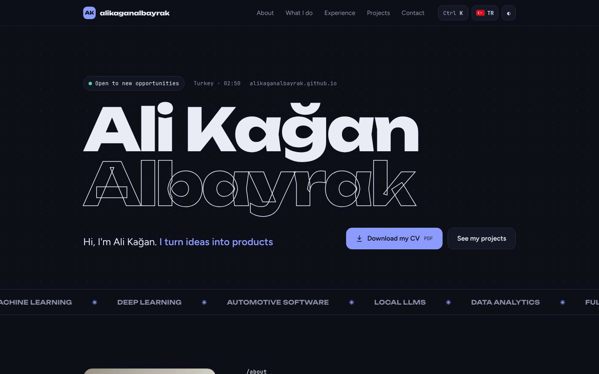
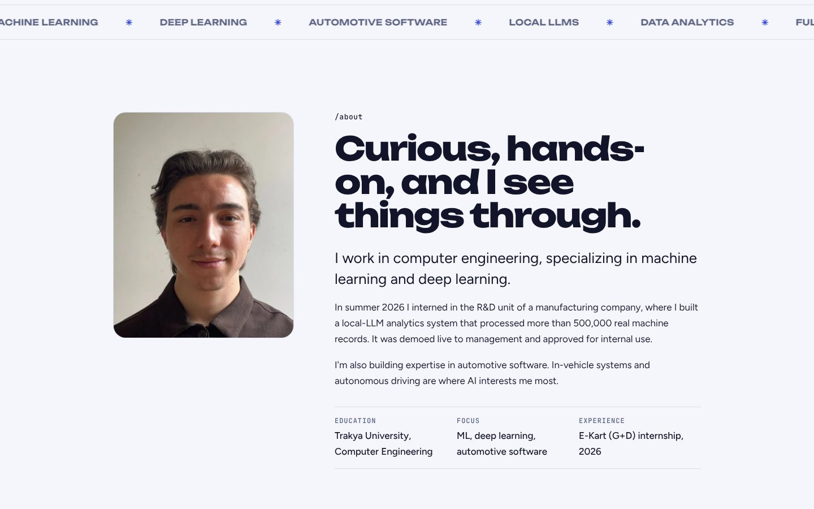
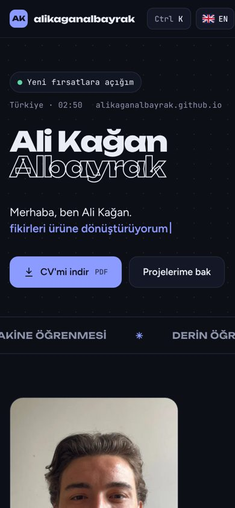

# Ali Kağan Albayrak · Personal Website


My personal website: who I am, what I work on (machine learning, deep learning and automotive software), my experience, projects and a downloadable CV. Available in **Turkish and English**.

**Live:** [alikaganalbayrak.github.io](https://alikaganalbayrak.github.io)



## Features

- **Turkish / English toggle**: flag button at the top right; the language is auto-detected from the browser and remembered.
- **Light / dark theme**: dark by default, with the choice saved locally.
- **Command palette**: press `Ctrl + K` (or `⌘ + K`) to jump to any section, download the CV or copy the email.
- **Interactive background**: a canvas dot field that reacts to the cursor.
- **Downloadable CV**: one click from the hero and the contact section.
- **Share card**: Open Graph image and meta tags for nice previews on LinkedIn, WhatsApp and X.
- **Responsive**: designed for desktop and mobile, no horizontal scroll.
- **Zero dependencies**: a single `index.html`, no framework, no build step.

## Sections

| Section | Content |
| --- | --- |
| Hero | Name, rotating focus areas, CV and projects buttons |
| About | Photo, education, focus and experience summary |
| What I do | ML / DL, languages, automotive software, web and infrastructure |
| Experience | E-Kart (Giesecke+Devrient) internship, Trakya University IoT Club |
| Projects | Local LLM analytics, Smart Wardrobe, Finansal Zeka, contract risk analyzer, Impostra |
| Contact | Email with copy button, GitHub, LinkedIn, CV |

## Screenshots

| Light theme | Mobile (Turkish) |
| --- | --- |
|  |  |

## Tech stack

- **HTML5 / CSS3 / vanilla JavaScript**
- **Fonts:** Unbounded, Figtree, JetBrains Mono (Google Fonts)
- **Hosting:** GitHub Pages, deployed automatically on every push to `main`

## Project structure

```
.
├── index.html                  # The whole site: markup, styles, scripts, translations
├── ali-kagan-albayrak.webp     # Profile photo (WebP, with JPG fallback)
├── ali-kagan-albayrak.jpg
├── og-image.png                # Social share card (1200x630)
├── cv/
│   └── Ali-Kagan-Albayrak-CV.pdf
├── docs/                       # README screenshots
└── .nojekyll
```

## Running locally

Open `index.html` in a browser, or serve the folder:

```bash
python3 -m http.server 8000
# then visit http://localhost:8000
```

## Contact

- Email: [alikaganalbayrak8@gmail.com](mailto:alikaganalbayrak8@gmail.com)
- LinkedIn: [linkedin.com/in/alikaganalbayrak](https://www.linkedin.com/in/alikaganalbayrak)
- GitHub: [@AliKaganAlbayrak](https://github.com/AliKaganAlbayrak)
